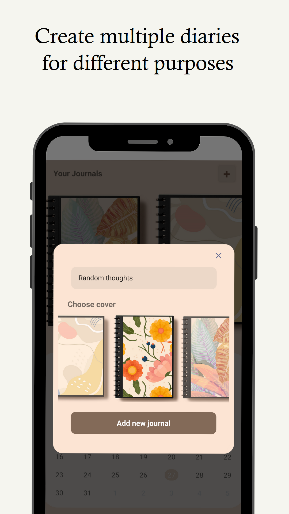
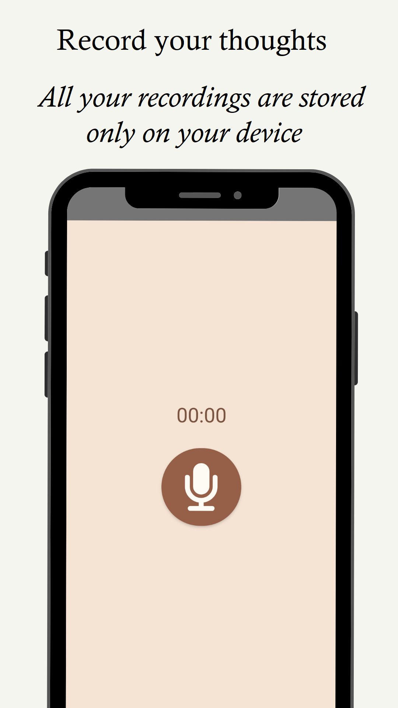
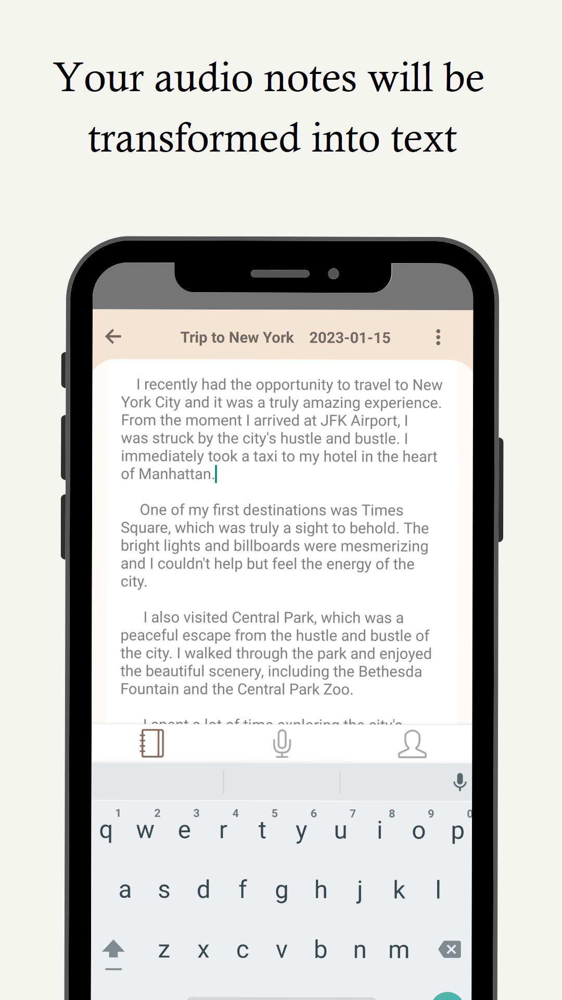
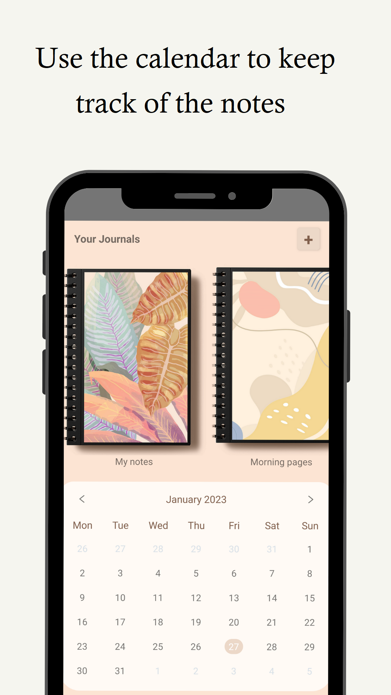

# 📝 Voice Journal — AudioNote2Text

> A voice journaling app that converts speech to text using custom Python backend with Speech Recognition.

[](https://play.google.com/store/apps/details?id=com.voicejournal)
[](https://reactnative.dev/)
[](https://python.org/)


## 📱 About

Voice Journal is a mobile journaling app that lets users record their thoughts by voice and automatically transcribes them to text. Perfect for capturing ideas on the go, morning pages, travel diaries, or work notes.

**Full-stack project:** I built both the **React Native mobile app** and the **Python speech-to-text backend** independently.

## ✨ Key Features

| Feature | Description |
|---------|-------------|
| 🎙️ **Voice Recording** | Record journal entries by speaking |
| 🔄 **Speech-to-Text** | Automatic transcription via custom Python backend |
| 📚 **Multiple Journals** | Organize entries into different notebooks |
| 📅 **Date Organization** | Entries sorted by date |
| 🖨️ **Print Support** | Export and print your journal entries |
| 🔒 **Privacy First** | All recordings stored locally on device |
| 🌍 **Multi-language** | Interface in Spanish, English, Russian |

## 🏗️ Architecture

This is a **full-stack project** with two main components:

```
┌────────────────────────────────────────────────────────────────┐
│                     MOBILE APP (React Native)                  │
│  ┌──────────────┐  ┌──────────────┐  ┌──────────────┐          │
│  │   Recording  │  │   Journals   │  │    Notes     │          │
│  │    Screen    │  │    List      │  │    View      │          │
│  └──────────────┘  └──────────────┘  └──────────────┘          │
│         │                                                      │
│  ┌──────┴──────────────────────────────────────────────┐       │
│  │              Audio Recording & Playback              │      │
│  │         react-native-audio-recorder-player           │      │
│  └──────────────────────────────────────────────────────┘      │
│         │                                                      │
│  ┌──────┴───────────────────────────────────────────────┐       │
│  │              Redux + Redux Persist                   │      │
│  │           (Offline state management)                 │      │
│  └──────────────────────────────────────────────────────┘      │
├────────────────────────────────────────────────────────────────┤
│                              ↓ HTTP POST (audio file)          │
├────────────────────────────────────────────────────────────────┤
│                     BACKEND (Python)                           │
│  ┌──────────────────────────────────────────────────────┐      │
│  │              Flask / FastAPI Server                  │      │
│  │                                                      │      │
│  │  ┌─────────────┐    ┌─────────────────────────┐      │      │
│  │  │   Receive   │───▶│   Speech Recognition    │      │     │
│  │  │   .wav file │    │   (Google/Whisper API)  │      │      │
│  │  └─────────────┘    └─────────────────────────┘      │      │
│  │                              │                       │      │
│  │                              ▼                       │      │
│  │                     Return transcribed text          │      │
│  └──────────────────────────────────────────────────────┘      │
└────────────────────────────────────────────────────────────────┘
```

## 🛠️ Tech Stack

### Mobile App (React Native)
```
Framework           │  React Native
State Management    │  Redux + Redux Persist
Audio               │  react-native-audio-recorder-player
File System         │  rn-fetch-blob, react-native-fs
Navigation          │  React Navigation
UI Components       │  Custom + react-native-modal
Permissions         │  Android runtime permissions handling
```

### Backend (Python)
```
Framework           │  Flask / FastAPI
Speech Recognition  │  Google Speech-to-Text API
Audio Processing    │  WAV file handling
Deployment          │  Custom VPS / Render.com
```

## 🧩 Technical Challenges & Solutions

### 1. Real-time Audio Recording with Permissions
**Challenge:** Managing Android permissions across different API levels (below and above Android 13).

**Solution:**
- Implemented comprehensive permission handling for `RECORD_AUDIO`, `READ_EXTERNAL_STORAGE`, `WRITE_EXTERNAL_STORAGE`
- Special handling for Android 13+ with `READ_MEDIA_AUDIO`
- Graceful fallbacks and retry logic

### 2. Audio File Upload & Processing
**Challenge:** Reliably uploading audio files from mobile to backend for transcription.

**Solution:**
- Used `react-native-fs` for multipart file uploads
- WAV format for consistent audio quality
- Error handling with retry mechanism
- Loading states with user feedback

### 3. Offline-First Journal Storage
**Challenge:** Users need access to their journals without internet.

**Solution:**
- Redux Persist for local state persistence
- All audio files stored in app's document directory
- Only transcription requires network connection
- Journals and notes available offline

### 4. Multi-Journal Organization
**Challenge:** Users wanted to organize entries into different notebooks (work, personal, travel, etc.).

**Solution:**
- Flexible data structure supporting multiple journals
- Dropdown selection for existing journals
- Create new journals on-the-fly
- Each journal with custom icon support

## 📸 Screenshots

<p align="center">
  
  
  
  
</p>

## 📊 Results

| Metric | Value |
|--------|-------|
| 📥 Downloads | **1,000+** |
| 🤖 Full-stack | Mobile + Python Backend |
| 🔄 API Calls | Speech-to-text processing |
| 📱 Platform | Android |

## 🔐 Privacy

- **Local storage:** All audio recordings stay on device
- **Minimal data transfer:** Only audio sent for transcription
- **No account required:** Full functionality without registration
- **Transcription only:** Backend doesn't store audio files

## 🔗 Links

| Resource | Link |
|----------|------|
| 📲 Google Play | [Play Store](https://play.google.com/store/apps/details?id=com.voicejournal) |
| 🎧 Main Project | [Positive Audio Affirmations](https://github.com/xenia19/affirmations-app) |
| 👩‍💻 Developer | [Portfolio](https://xenia19.github.io/portfolio/) |

## 👩‍💻 About the Developer

I'm **Xenia**, a full-stack mobile developer based in Italy. This project demonstrates my ability to build both frontend (React Native) and backend (Python) components of a mobile application.

**Skills demonstrated:**
- 📱 React Native mobile development
- 🐍 Python backend development
- 🔊 Audio recording and processing
- 🤖 Speech-to-Text API integration
- 📦 State management with Redux
- 🔒 Android permissions handling

---

## ⚠️ Source Code

This repository contains **documentation and architecture overview only**. The source code is proprietary.

## 📄 License

© 2024 Xenia Galaktionova. All rights reserved.
